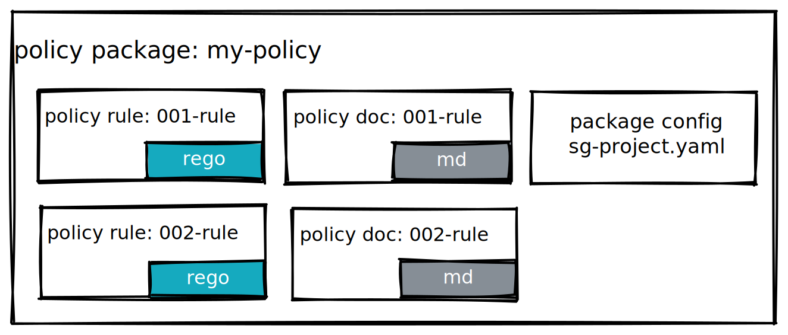

# Writing Policy

ShieldGuard validates various kind of data by executing a set of defined policy rules.
This documentation describes how to write and organize these policy rules for a project.

A simple diagram for getting quick understanding of these entities:



## What's a policy rule?

Policy is the minimum execution unit in ShieldGuard. Each policy will be applied against each input data.
If the input data violates the policy, the policy should return an advisory message to help user
to understand the reason and potential mitigation steps.

In ShieldGuard, we express each policy rule as an expression with OPA policy language.

We can further break down a policy rule as follow:

```rego
deny_host_volume[msg] { /* some content */ }
^^^^ ---- policy kind

deny_host_volume[msg] { /* some content */ }
     ^^^^^^^^^^^ ---- policy name

deny_host_volume[msg] { /* some content */ }
                 ^^^^^^^^^^^^^^^^^^^^^^^^^^ ---- policy implementation
```

And besides the OPA policy language itself, we also provide a by convention documentation reference based on the policy name.

### Policy Kind

### Policy Name

### Policy Implementation

### Policy Documentation

## Policy Package

### Reusing Policy Packages